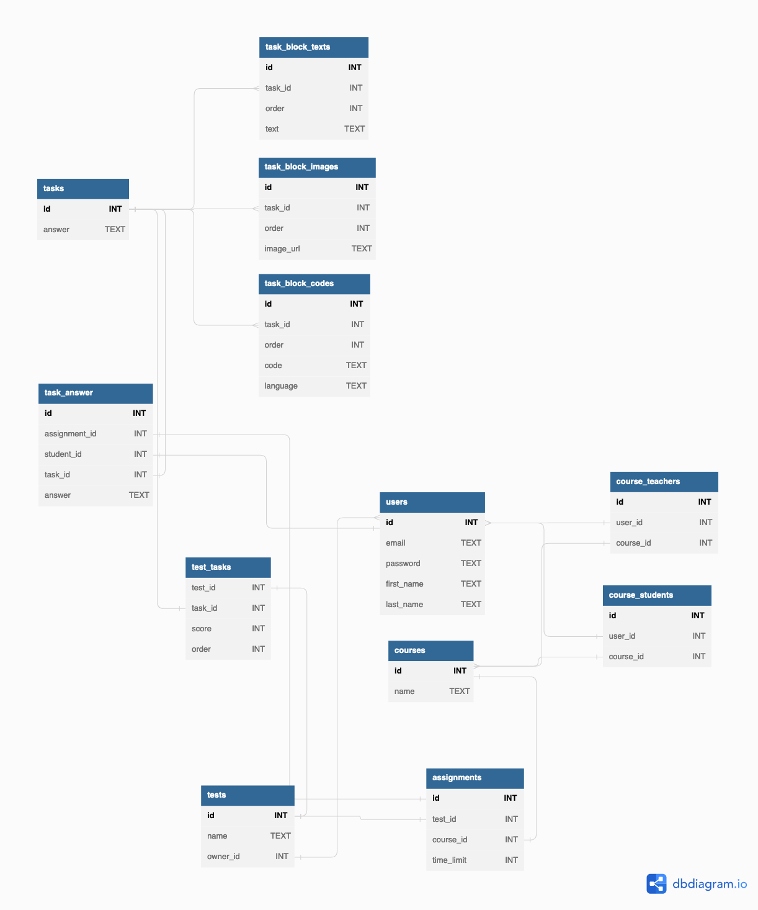
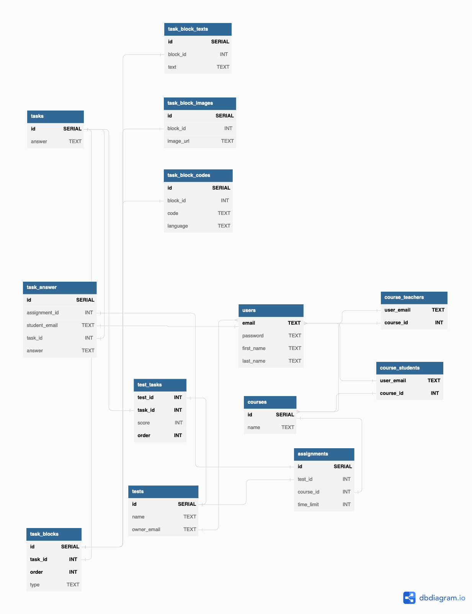

## Кому нужна разрабатываемая программа, как она будет использоваться

Требуется разработать сервис для проведения тестов и викторин. Необходимо создать админ-панель для управления викторинами. Сервис будет использоваться в образовательных организациях для проведения проверочных работ, экзаменов, других элементов контроля, а также для закрепления пройденного материала.

## Функциональные требования

1. Задание состоит из следующих элементов:

- Произвольное количество блоков любого из следующих типов
  - Изображение
  - Текст
  - Код с подсветкой синтаксиса
- Правльный ответ в виде текста

2. Каждый тест состоит из названия, времени на выполнение, заданий. К каждому заданию опционально можно добавить количество баллов за правильный ответ.

3. Необходима возможность создавать учебные курсы, которые характеризуются названием. Учебный курс содержит множество учеников. Для учебного курса могут быть назначены тесты.

4. Любой пользователь (ученик или преподаватель) при регистрации указывает фамилию, имя, адрес электронной почты, пароль. Вход в систему осуществляется по паре [адрес электронной почты, пароль].

5. Должна быть возможность предоставления доступа к курсам для преподавателей с целью управления составом учеников курса, назначения тестов.

6. Результаты выполнения тестов должны быть сохранены с целью дальнейшей обработки преподавателем или автоматически.

## Предварительная схема БД



```sql
Table "users" {
  "id" INT [pk]
  "email" TEXT [unique]
  "password" TEXT
  "first_name" TEXT
  "last_name" TEXT
}

// Tasks
Table "tasks" {
  "id" INT [pk]
  "answer" TEXT
}

Table "task_block_texts" {
  "id" INT [pk]
  "task_id" INT [ref: > tasks.id]
  "order" INT

  "text" TEXT
}

Table "task_block_images" {
  "id" INT [pk]
  "task_id" INT [ref: > tasks.id]
  "order" INT

  "image_url" TEXT
}

Table "task_block_codes" {
  "id" INT [pk]
  "task_id" INT [ref: > tasks.id]
  "order" INT

  "code" TEXT
  "language" TEXT
}

// Courses
Table "courses" {
  "id" INT [pk]
  "name" TEXT
}

Table "course_teachers" {
  "id" INT [pk]
  "user_id" INT [ref: < users.id]
  "course_id" INT [ref: < courses.id]
}

Table "course_students" {
  "id" INT [pk]
  "user_id" INT [ref: < users.id]
  "course_id" INT [ref: < courses.id]
}

// Tests
Table tests {
  "id" INT [pk]
  "name" TEXT
  "owner_id" INT [ref: < users.id]
}

Table test_tasks {
  "test_id" INT [ref: - tests.id]
  "task_id" INT [ref: - tasks.id]
  "score" INT
  "order" INT
}

Table assignments {
  "id" INT [pk]
  "test_id" INT [ref: - tests.id]
  "course_id" INT [ref: - courses.id]
  "time_limit" INT
}

Table task_answer {
  "id" INT [pk]
  "assignment_id" INT [ref: - assignments.id]
  "student_id" INT [ref: - users.id]
  "task_id" INT [ref: - tasks.id]
  "answer" TEXT
}
```

## Из функциональных требований выводятся ограничения на данные

1. Задание должно содержать не менее одного блока
2. Изображение в блоке и изображением задания не должно быть пустым
3. Текст в блоке с текстом задания не должен быть пустой строкой
4. Код и язык программирования блоке с кодом задания не должны быть пустыми строками
5. Название теста не должно быть пустой строкой
6. Тест должен содержать не менее одного задания
7. Время на выполнение теста может быть не указано, что означает, что время на выполнение не ограничн
8. Название учебного курса не должно быть пустой строкой
9. Учебный курс должен содержать не менее одного преподавателя
10. Ответ ученика на задание не может быть пустой строкой
11. Два пользователя не могут иметь одинаковый email

## Текстовые ограничения представляются в виде функциональных и многозначных зависимостей

```
users:
    id -> email
    id -> password
    email -> password
    id -> first_name
    email -> first_name
    id -> last_name
    email -> last_name
```

Так как email уникален, он может использоваться в качестве первичного ключа.

```
tasks:
    id -> answer
```

```
task_block_texts:
    id -> task_id
    id -> order
    id -> text

    taskid,order -> text
```

Пара (taskid,order) может использоваться в качестве первичного ключа.

```
task_block_images:
    id -> task_id
    id -> order
    id -> image_url

    taskid,order -> image_url
```

Пара (taskid,order) может использоваться в качестве первичного ключа.

```
task_block_codes:
    id -> task_id
    id -> order
    id -> code
    id -> language

    taskid,order -> code
    taskid,order -> language
```

Пара (taskid,order) может использоваться в качестве первичного ключа.

```
courses:
    id -> name
```

```
course_teachers:
    id -> user_id
    id -> course_id
```

Пара (user_id,course_id) может использоваться в качестве первичного ключа.

```
course_students:
    id -> user_id
    id -> course_id
```

Пара (user_id,course_id) может использоваться в качестве первичного ключа.

```
tests:
    id -> name
    id -> owner_id
```

Если сказать, что пользователь не может создать 2 теста с одинаковым названием, можно будет сделать пару (name, owner_id) первичным ключом.

```
test_tasks:
    test_id,task_id -> score
    test_id,task_id -> order
```

```
assignments:
    id -> test_id
    id -> course_id
    id -> time_limit
```

Оставляем возможность дважды назначать один тест для одной учебной группы.

```
task_answer:
    id -> assignment_id
    id -> student_id
    id -> task_id
    id -> answer
```

## Нормализация предварительной схемы относительно множества зависимостей

1. Все отношения находятся в 1НФ. Все атрибуты имеют скалярные значения. Нормализация могла бы пострадать, если бы таблица task_answer представляла ответы ученика на тест в виде массива элементов.

2. Все отношения находится во 2НФ.

3. В отношении `users` есть транзитивная зависимость `id -> email`. Отношение не находится в 3НФ. Исправим при помощи удаления поля `id` и назначением `email` в качестве первичного ключа.

4. Все отношения находится в НФБК.
5. Все отношения находится в 4НФ.

В текущей реализации может получиться, что у одного задания будут два разных блока с одинаковым порядком (order). Такое возможно из-за того, что первичный ключ (task_id, order) в таблицах `task_block_texts`, `task_block_codes`, `task_block_images` запрещает подобное поведение на уровне одной таблицы, но не на уровне нескольких таблиц. Создадим новую таблицу, которая будет отвечать за порядок блока в рамках одного задания.

```sql
task_blocks {
  "task_id" INT [ref: - tasks.id]
  "order" INT
  "type" TEXT

  indexes {
    (task_id, order) [pk]
  }
}
```

Нормализованная схема


```sql
Table "users" {
  "email" TEXT [pk]
  "password" TEXT
  "first_name" TEXT
  "last_name" TEXT
}

// Tasks
Table "tasks" {
  "id" SERIAL [pk]
  "answer" TEXT
}

Table task_blocks {
  "id" SERIAL [pk]
  "task_id" INT [ref: - tasks.id]
  "order" INT

  indexes {
    (task_id, order) [pk]
  }
}

Table "task_block_texts" {
  "id" SERIAL [pk]
  "block_id" INT [ref: - task_blocks.id]
  "text" TEXT
}

Table "task_block_images" {
  "id" SERIAL [pk]
  "block_id" INT [ref: - task_blocks.id]
  "image_url" TEXT
}

Table "task_block_codes" {
  "id" SERIAL [pk]
  "block_id" INT [ref: - task_blocks.id]
  "code" TEXT
  "language" TEXT
}

// Courses
Table "courses" {
  "id" SERIAL [pk]
  "name" TEXT
}

Table "course_teachers" {
  "user_email" TEXT [ref: < users.email]
  "course_id" INT [ref: < courses.id]
  indexes {
    (user_email, course_id) [pk]
  }
}

Table "course_students" {
  "user_email" TEXT [ref: < users.email]
  "course_id" INT [ref: < courses.id]
  indexes {
    (user_email, course_id) [pk]
  }
}

// Tests
Table tests {
  "id" SERIAL [pk]
  "name" TEXT
  "owner_email" TEXT [ref: < users.email]
}

Table test_tasks {
  "test_id" INT [ref: - tests.id]
  "task_id" INT [ref: - tasks.id]
  "score" INT
  "order" INT
  indexes {
    (test_id, task_id, order) [pk]
  }
}

Table assignments {
  "id" SERIAL [pk]
  "test_id" INT [ref: - tests.id]
  "course_id" INT [ref: - courses.id]
  "time_limit" INT
}

Table task_answer {
  "id" SERIAL [pk]
  "assignment_id" INT [ref: - assignments.id]
  "student_email" TEXT [ref: - users.email]
  "task_id" INT [ref: - tasks.id]
  "answer" TEXT
}

```

## превращение нормализованной схемы в скрипт на SQL DDL

```sql
CREATE TABLE "users" (
  "email" TEXT PRIMARY KEY,
  "password" TEXT NOT NULL,
  "first_name" TEXT NOT NULL,
  "last_name" TEXT
);

CREATE TABLE "tasks" (
  "id" SERIAL PRIMARY KEY,
  "answer" TEXT NOT NULL
);

CREATE TABLE "task_blocks" (
  "id" SERIAL UNIQUE,
  "task_id" INT NOT NULL,
  "order" INT NOT NULL,
  PRIMARY KEY ("task_id", "order")
);

CREATE TABLE "task_block_texts" (
  "id" SERIAL PRIMARY KEY,
  "block_id" INT NOT NULL,
  "text" TEXT NOT NULL
);

CREATE TABLE "task_block_images" (
  "id" SERIAL PRIMARY KEY,
  "block_id" INT NOT NULL,
  "image_url" TEXT NOT NULL
);

CREATE TABLE "task_block_codes" (
  "id" SERIAL PRIMARY KEY,
  "block_id" INT NOT NULL,
  "code" TEXT NOT NULL,
  "language" TEXT
);

CREATE TABLE "courses" (
  "id" SERIAL PRIMARY KEY,
  "name" TEXT NOT NULL
);

CREATE TABLE "course_teachers" (
  "user_email" TEXT,
  "course_id" INT,
  PRIMARY KEY ("user_email", "course_id")
);

CREATE TABLE "course_students" (
  "user_email" TEXT,
  "course_id" INT,
  PRIMARY KEY ("user_email", "course_id")
);

CREATE TABLE "tests" (
  "id" SERIAL PRIMARY KEY,
  "name" TEXT NOT NULL,
  "owner_email" TEXT NOT NULL
);

CREATE TABLE "test_tasks" (
  "test_id" INT NOT NULL,
  "task_id" INT NOT NULL,
  "score" INT NOT NULL,
  "order" INT NOT NULL,
  PRIMARY KEY ("test_id", "task_id", "order")
);

CREATE TABLE "assignments" (
  "id" SERIAL PRIMARY KEY,
  "test_id" INT NOT NULL,
  "course_id" INT NOT NULL,
  "time_limit" INT
);

CREATE TABLE "task_answer" (
  "id" SERIAL PRIMARY KEY,
  "assignment_id" INT NOT NULL,
  "student_email" TEXT NOT NULL,
  "task_id" INT NOT NULL,
  "answer" TEXT NOT NULL
);

ALTER TABLE "task_blocks" ADD FOREIGN KEY ("task_id") REFERENCES "tasks" ("id");

ALTER TABLE "task_block_texts" ADD FOREIGN KEY ("block_id") REFERENCES "task_blocks" ("id");

ALTER TABLE "task_block_images" ADD FOREIGN KEY ("block_id") REFERENCES "task_blocks" ("id");

ALTER TABLE "task_block_codes" ADD FOREIGN KEY ("block_id") REFERENCES "task_blocks" ("id");

ALTER TABLE "course_teachers" ADD FOREIGN KEY ("user_email") REFERENCES "users" ("email");

ALTER TABLE "course_teachers" ADD FOREIGN KEY ("course_id") REFERENCES "courses" ("id");

ALTER TABLE "course_students" ADD FOREIGN KEY ("user_email") REFERENCES "users" ("email");

ALTER TABLE "course_students" ADD FOREIGN KEY ("course_id") REFERENCES "courses" ("id");

ALTER TABLE "tests" ADD FOREIGN KEY ("owner_email") REFERENCES "users" ("email");

ALTER TABLE "test_tasks" ADD FOREIGN KEY ("test_id") REFERENCES "tests" ("id");

ALTER TABLE "test_tasks" ADD FOREIGN KEY ("task_id") REFERENCES "tasks" ("id");

ALTER TABLE "assignments" ADD FOREIGN KEY ("test_id") REFERENCES "tests" ("id");

ALTER TABLE "assignments" ADD FOREIGN KEY ("course_id") REFERENCES "courses" ("id");

ALTER TABLE "task_answer" ADD FOREIGN KEY ("assignment_id") REFERENCES "assignments" ("id");

ALTER TABLE "task_answer" ADD FOREIGN KEY ("student_email") REFERENCES "users" ("email");

ALTER TABLE "task_answer" ADD FOREIGN KEY ("task_id") REFERENCES "tasks" ("id");
```

## Написание запросов на SQL DML, группировка в транзакции

```sql
-- Get task blocks
BEGIN;
SELECT "text","code","language","image_url" FROM task_blocks
    LEFT JOIN task_block_texts tbt on task_blocks.id = tbt.block_id
    LEFT JOIN task_block_codes tbc on task_blocks.id = tbc.block_id
    LEFT JOIN task_block_images tbi on task_blocks.id = tbi.block_id
WHERE task_id = 6
ORDER BY "order";
COMMIT;

-- Add new task
BEGIN;
WITH task AS (INSERT INTO tasks (answer) VALUES ('ans') RETURNING id),
block1 AS (INSERT INTO task_blocks (task_id, "order") VALUES ((SELECT id FROM task), 0) RETURNING id),
block2 AS (INSERT INTO task_blocks (task_id, "order") VALUES ((SELECT id FROM task), 1) RETURNING id),
block3 AS (INSERT INTO task_blocks (task_id, "order") VALUES ((SELECT id FROM task), 2) RETURNING id),
_ AS (INSERT INTO task_block_texts (block_id, text) VALUES ((SELECT id from block1), 'В результате выполнения программы')),
__ AS (INSERT INTO task_block_texts (block_id, text) VALUES ((SELECT id from block3), 'На экран будет выведено'))
INSERT INTO task_block_codes (block_id, code, language) VALUES ((SELECT id from block2), 'printf("ans")', 'c');
COMMIT;

-- Create course
BEGIN;
WITH course AS (INSERT INTO courses ("name") VALUES ('3 Курс ПИ') RETURNING id),
_ AS (INSERT INTO course_teachers (user_email, course_id) VALUES (
    (SELECT "email" FROM users LIMIT 1),
    (SELECT "id" FROM course))
)
INSERT INTO course_students (user_email, course_id) VALUES (
    (SELECT "email" FROM users  OFFSET 1 LIMIT 1),
    (SELECT "id" FROM course)
);
COMMIT;

-- Create test
BEGIN;
WITH test AS (
    INSERT INTO tests (name, owner_email) VALUES ('Тест для ПИ 3 курс', (SELECT "email" FROM users LIMIT 1))
    RETURNING id
)
INSERT INTO test_tasks (test_id, task_id, score, "order") VALUES (
    (SELECT "id" from test),
    (SELECT "id" FROM tasks LIMIT 1),
    10,
    0
);
COMMIT;
```
